# 幻想空間 — Leisure Suit Larry in the Land of the Lounge Lizards 繁體中文化

> Sierra On-Line ｜ Al Lowe ｜ 1987（AGI/EGA）＋ 1991（SCI/VGA）
> ScummVM 繁體中文化 patch ｜ EGA・VGA 雙版本，全程對白中文化

---

還記得嗎？

那個要你先答對一堆成人常識題才准進門的遊戲。那個穿著一身過時的白色休閒西裝、頂著半禿的頭、口袋裡只有 94 塊美金、40 歲了還是處男的中年魯蛇——**賴瑞（Larry Laffer）**。他只有一個晚上，要在賭城 Lost Wages 追到真愛。

當年在 14 吋 CRT 螢幕前，我們被那道年齡驗證問答擋在門外，翻遍手邊每一本雜誌也答不出「Johnny Carson 的搭檔是誰」。三十幾年過去，那句開場白，現在說中文了：

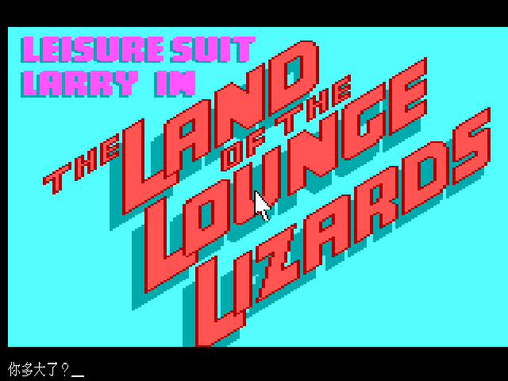

這個 repo，把《幻想空間》的兩個歷史版本——1987 年的 AGI 原版、1991 年的 VGA 重製版——完整地說回繁體中文。

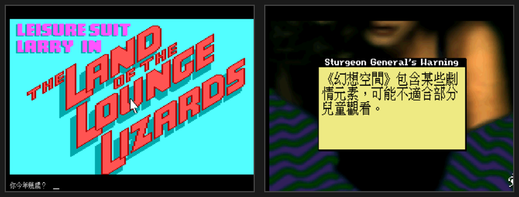

*左：1987 EGA（AGI 引擎，16 色）｜右：1991 VGA（SCI 引擎，256 色）。同一款遊戲、兩個世代，這次都是中文。*

連**標題畫面**都說中文了——引擎在遊戲內的標題畫面上疊繪「幻想空間」，保留原本經典的英文 logo：

| 1987 EGA 標題 | 1991 VGA 標題 |
|:---:|:---:|
| 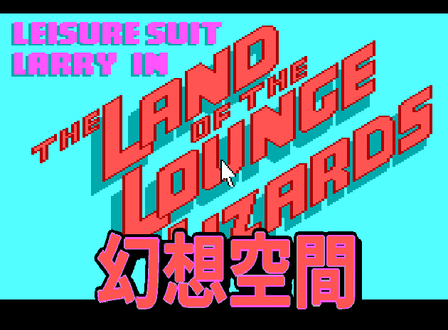 | 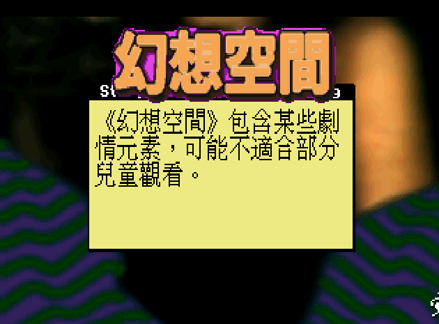 |

*不改遊戲原始美術，由引擎在標題畫面 render 時把「幻想空間」點陣標題疊上（EGA 對齊 16 色調色盤、VGA 對映當前 palette）。*

---

## 目錄

- [這是什麼](#這是什麼)
- [一個穿廉價西裝的中年魯蛇](#一個穿廉價西裝的中年魯蛇)
- [失樂城 Lost Wages 一夜情事](#失樂城-lost-wages-一夜情事)
- [通關要點（給卡關的你）](#通關要點給卡關的你)
- [那些讓人又愛又恨的名場面](#那些讓人又愛又恨的名場面)
- [招牌賣點：台式在地化，把美式冷笑話翻成台灣人一看就笑](#招牌賣點台式在地化把美式冷笑話翻成台灣人一看就笑)
- [關於那道「密碼保護問答」](#關於那道密碼保護問答)
- [譯名對照](#譯名對照)
- [他說沒有中文版。現在有了。](#他說沒有中文版現在有了)
- [怎麼玩](#怎麼玩)
- [技術細節：怎麼讓 1987 年的引擎吐出方塊字](#技術細節怎麼讓-1987-年的引擎吐出方塊字)
- [交付政策 · 授權 · 致謝](#交付政策--授權--致謝)

---

## 這是什麼

《Leisure Suit Larry in the Land of the Lounge Lizards》，華語圈通稱**《幻想空間》**，是 Sierra 冒險遊戲鬼才 **Al Lowe** 的成人喜劇代表作。本專案以 **ScummVM patch** 形式為它做繁體中文化，同時涵蓋兩個引擎完全不同的歷史版本：

| 版本 | 年份 | 引擎 | 畫面 | 操作 |
|---|---|---|---|---|
| **EGA 版** | 1987 | AGI 2.440 | 16 色 320×200 | 打字輸入指令 |
| **VGA 版** | 1991 | SCI1 | 256 色 320×200 | 點擊 icon |

> 目前進度：**兩版核心對白全數中文化並實機驗證**（EGA 約 1,466 則、VGA 約 2,778 則訊息）。技術路線與里程碑見 [`docs/00-overall-plan.md`](docs/00-overall-plan.md)。

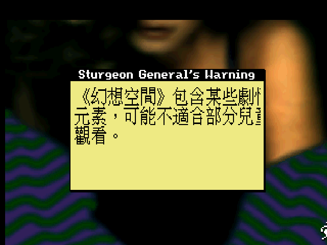

*VGA 版一開場的「Sturgeon 將軍警告」——戲仿美國菸盒上的衛生署警語：「《幻想空間》包含某些劇情元素，可能不適合部分兒童觀看。」連免責聲明都要幽默一下，很 Al Lowe。*

這份中文化不是「使用手冊」，是寫給三十年後同代玩家的一封信。你可以三層讀：想直接玩，跳到 [怎麼玩](#怎麼玩)；想懷舊，慢慢讀完每一章；想知道技術怎麼幹的，看最後的 [技術細節](#技術細節怎麼讓-1987-年的引擎吐出方塊字)。

而如果你只想看一件事，看這個——我們沒有把 Al Lowe 的美式黃色冷笑話「翻成中文」就交差，而是把它們**重寫成台灣人一看就笑**的版本。這是本專案最花心思、也最想炫耀的部分，直接跳 [招牌賣點：台式在地化](#招牌賣點台式在地化把美式冷笑話翻成台灣人一看就笑)。

---

## 一個穿廉價西裝的中年魯蛇

先講一段你可能不知道的來歷。

1987 年，Sierra 共同創辦人 Ken Williams 要 Al Lowe 把 1981 年的文字遊戲《Softporn Adventure》重做成現代版。Al Lowe 看了一眼那個俗到出水的主角，吐槽了一句：「這遊戲過時到**應該穿件休閒西裝（leisure suit）**。」——系列名和賴瑞這個角色，就是這麼一句玩笑話定下來的。

有趣的是，Al Lowe 在做賴瑞之前，手上多半是**迪士尼授權的兒童遊戲**（小熊維尼、米奇、唐老鴨）。從童書跳到黃色喜劇，反差之大堪稱電玩史奇景。而他自己說得很清楚：他要做的是一款**喜劇**，不是色情遊戲。全片靠的是滿到溢出來的**性暗示與自嘲**，而不是露骨畫面——這也是為什麼買《國王密使》《太空冒險》的正經玩家，也能笑著把它玩完。

上市首月只賣了約 4,000 套。沒廣告、通路排斥、媒體不敢報，成人題材在 1987 年就是這種待遇。但它靠口碑長銷，最終突破 30 萬套，成了 Sierra 最知名的招牌之一；整個系列到 2011 年累積約 1,000 萬套。**一個穿廉價西裝的魯蛇，撐起了一個王朝。**

> 「你的豔裝套裝很時髦，但口袋空空。」
>
> — 遊戲一開場檢視賴瑞行頭時的旁白（本專案實際譯文）。40 歲、94 塊美金、一身過時白西裝，人物設定一句話說完。

---

## 失樂城 Lost Wages 一夜情事

賴瑞的舞台是虛構賭城 **Lost Wages**——諧擬 Las Vegas，直譯是「**輸掉的薪水**」。光是地名就是個雙關梗，很 Al Lowe。

你的任務單純到可悲：**一個晚上，追到真愛，順便破處。** 全遊戲繞著五個場景打轉：

| 場景 | 你在這裡幹嘛 |
|---|---|
| **Lefty's Bar**（老左酒吧）| 起點。點杯威士忌別喝、拿玫瑰、樓上有第一位「攻略對象」 |
| **旅館兼賭場**（Hotel-Casino）| 玩 21 點翻本；接待員 Faith 在櫃檯 |
| **迪斯可舞廳**（Disco）| 認識詐婚女 Fawn |
| **結婚禮堂**（Wedding Chapel）| 跟 Fawn 閃婚 |
| **便利商店**（Convenience Store）| 採買關鍵道具（酒、雜誌、保險套）|

外加旅館頂樓的**蜜月套房**與泳池畔的終極目標 **Eve（伊芙）**。

一位台灣玩家回顧時講得最傳神：這遊戲裡等你攻略的女性，「一如宅男的刻板印象，只喜歡糖果、鑽石、玫瑰跟金錢。**特別是錢。**」——這句話，某種程度上就是整款遊戲的世界觀。

而故事的起點，就在那間霓虹招牌閃爍的老左酒吧門口：

> 「你站在老左酒吧外。霓虹燈這東西真是神奇，隨便閃兩下就有夜店的感覺，是吧？」
>
> — 走進第一個場景時的旁白（本專案**台式在地化**實際譯文）。比起規矩的直譯「霓虹燈的魔力真妙不可言」，在地化版更像台灣人會脫口而出的口氣。推門進去，裡頭是「你見過最骯髒下流的酒吧」。

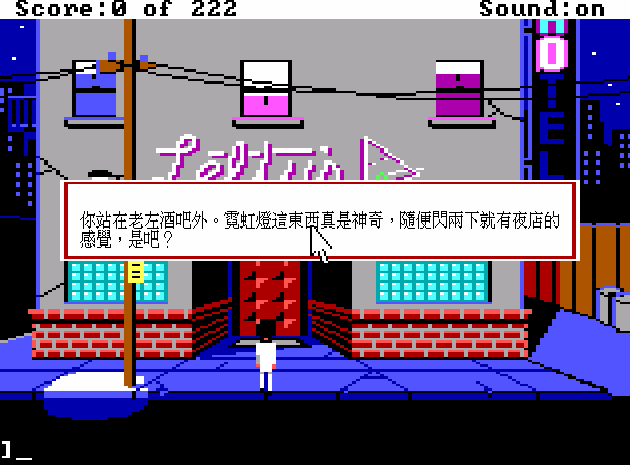

*實機畫面：EGA 版下「看」指令，跳出的就是這句台式在地化旁白。*

| 1987 EGA：站在老左酒吧門口 | 1991 VGA：同一扇門，256 色重製 |
|:---:|:---:|
| 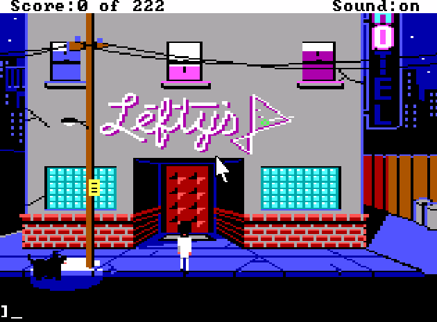 | 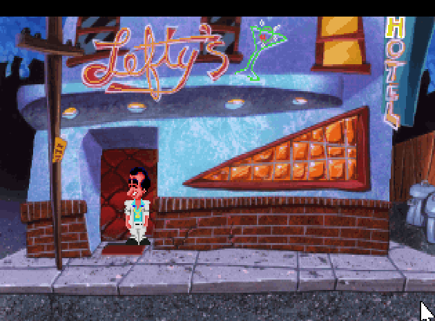 |

推門進去，霓虹、駝鹿頭標本、點唱機、牆上的裸女畫——還有一屋子等著吐槽你的酒客：

| EGA 酒吧內部 · 中文對白 | VGA 酒吧內部 · 中文對白 |
|:---:|:---:|
| 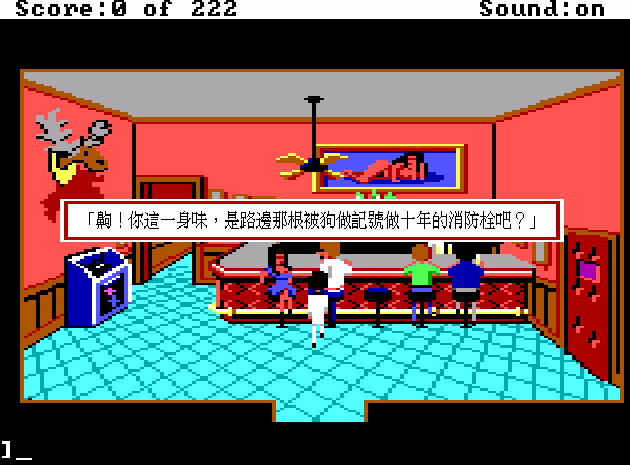 | 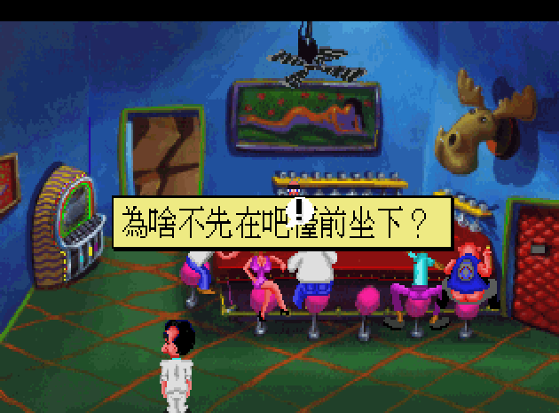 |
| 「呸！你聞起來像用過的消防栓！」 | 「為啥不先在吧檯前坐下？」 |

---

## 通關要點（給卡關的你）

沒有 GameFAQ、沒有 Discord、沒有 wiki 的年代，卡關就是卡關。這裡把主線的十二個關鍵動作條列出來，當年你可能為了其中一步卡了整個週末：

1. **酒吧開場**：進門、坐吧檯，向酒保點一杯威士忌——**別喝**，留著。
2. **撿道具**：拿走桌上的**玫瑰**；廁所裡撿到**戒指**。
3. **威士忌換遙控器**：把威士忌給醉漢，換得電視**遙控器**。
4. **戲弄皮條客**：用遙控器狂轉電視頻道惹毛皮條客，觸發上樓橋段。
5. **賭場翻本**：去玩 **21 點或吃角子老虎**，把 94 元變多——後面搭車、採買都要錢，**沒錢會卡死**。
6. **計程車移動**：場景間靠計程車往返（要付錢），這是一關資源管理。
7. **便利商店採買**：買**葡萄酒**、**雜誌**，以及關鍵的**保險套**。
8. **混進舞廳**：用撿到的**迪斯可卡/信用卡**打發保鑣，進場認識 Fawn。
9. **哄 Fawn**：依序送她**玫瑰、糖果、戒指，外加 $200**，她才點頭。
10. **閃婚 → 蜜月套房**：到教堂結婚，進旅館 4 樓蜜月套房辦事——結果 Fawn 捲款落跑。
11. **翻窗逃生**：用**緞帶/繩子**綁欄杆、加**鐵鎚**破窗逃出。
12. **最終攻略 Eve**：上 8 樓泳池，用**藥丸**與**蘋果**完成對 Eve 的攻略，通關。

**最容易死在哪**：錢沒管好（付不出車錢/採買）、忘了帶某件小道具就進下一場景，以及——那個惡名昭彰的**七小時倒數**（見下章）。

---

## 那些讓人又愛又恨的名場面

**七小時實時自盡。** 這是全片最狠的設計：遊戲有一個**現實時間七小時**的倒數，時間到你還沒破處，**賴瑞會當場舉槍自盡**。同一段過場，Sierra 一邊放《威廉泰爾序曲》一邊放《送葬進行曲》——黑色幽默拉到滿格。

**千奇百怪的死法。** 走上馬路被憑空冒出的車輾成薄餅；走進暗巷被搶匪打死；在商店順手牽羊被店員一槍斃命；連在酒吧廁所按下沖水都能死。每一種死法都配上 Sierra 招牌的挖苦旁白——**死給你看，還要吐槽你。**

> 「賴瑞，你什麼時候才能學會不進那些黑暗小巷！！」
> 「既然你已經死了，為什麼還在說話？？只管享受這趟旅程吧。」
> 「好像橋墩讓你的遊戲戛然而止了！記住啊 Larry：真朋友不會讓計程車司機酒駕！」
>
> — 三段死亡旁白（本專案實際譯文）。Sierra 冒險遊戲的靈魂：死法本身就是笑點。

**計程車與賭博。** 移動全靠計程車，司機是你與錢包搏鬥的固定戲碼；靠 21 點翻本，把「賭城」這個主題玩進了核心機制。

**Sierra 式自嘲結尾。** 全片沒有一刻停止性暗示與自我調侃，一路婊到結局字幕。

---

## 招牌賣點：台式在地化，把美式冷笑話翻成台灣人一看就笑

上一章那些死法吐槽、那股又賤又自嘲的味道，是《幻想空間》的靈魂。可是靈魂有個麻煩：**它是用 1987 年的美式黃色冷笑話講的。** Johnny Carson 的搭檔、菸盒衛生署警語、美式脫口秀節奏——這些梗，台灣玩家就算讀得懂英文，也很難「一看就笑」。笑話最怕的就是要人先查資料才懂，查完，笑點也涼了。

所以這份中文化做的不只是翻譯，是**在地化再創作**：把 Al Lowe 想逗你笑的那個點，換成台灣人生活裡真的會笑的講法。定位就一句話：

> **色在雙關、笑在自嘲、賤在旁白——露骨留白，台語提味，年代感點到為止。**

字面乾淨，黃在諧音與聯想裡（跟原作的 double entendre 是同一招）；台味走中度提味，口語國語為主，關鍵情緒點插一個台語詞（歹勢、衝、款、衰）；年代感也只點一下，不整段掉書袋。

下面是幾張已經驗證過的樣張，左邊是規規矩矩的直譯，右邊是台式在地化——同一句話，笑點差多少，你自己看：

| 情境 | 現行直譯 | 台式在地化 |
|---|---|---|
| **賴瑞行頭** | 你的豔裝套裝很時髦，但口袋空空。 | 這身騷包白西裝是你全身最值錢的行頭——偏偏口袋比臉還乾淨。 |
| **暗巷橫死** | 賴瑞，你什麼時候才能學會不進那些黑暗小巷！！ | 驚傳！中年男夜闖暗巷慘遭「關切」，當場領便當。 |
| **死後吐槽** | 既然你已經死了，為什麼還在說話？ | 都領便當了還在碎念？歹勢啦，坐乎穩別亂動，好好享受這趟單程之旅。 |
| **酒客嗆聲** | 呸！你聞起來像用過的消防栓！ | 齁！你這一身味，是路邊那根被狗做記號做十年的消防栓吧？ |
| **好色雙關** | （曖昧場景，原作靠暗示） | 賴瑞盯著她看到失神，滿腦子只想「交流」一下——可惜人家想交流的，只有你皮夾裡那幾張小朋友。 |

看出手法了嗎？拆開來是四招：

- **報紙社會版標題腔**：死法吐槽套上「驚傳！中年男夜闖暗巷……當場領便當」這種 80、90 年代社會新聞的誇張標題腔，把賴瑞的蠢死報得像頭條。
- **自嘲魯蛇**：口袋比臉還乾淨、全身最值錢的是那件過時白西裝——賴瑞越慘越好笑，這條幾乎不會過火，能大量用。
- **台語提味**：句子主體還是國語，只在情緒的節骨眼放一個台語詞（歹勢、齁、坐乎穩），口氣立刻對了，又不會讓聽不懂台語的人卡住。
- **諧音雙關，點到為止**：「交流」「小朋友」，字面乾淨得能過審，黃的那一半留白，讓玩家自己接——這正是原作 double entendre 的台灣版打法。

還有一條看不見的紀律：**分寸**。原作有些年代性的冒犯玩笑（身材、族群），在地化時改成賴瑞自己的糗，不原樣照搬；露骨的器官描述靠諧音留白，不直說。葷笑點一律對準「賴瑞很衰、很色、很魯」，不掃到真人、不碰政治族群。梗庫、手法與尺度的完整規格，收在 [`docs/localization/taiwan-humor-refs.md`](docs/localization/taiwan-humor-refs.md)。

老實說一句：目前是**風格已定案、上面這幾張樣張已實機驗證**，全量對白的在地化仍在進行中——你在其他章節看到的引文，多半還是打底的直譯版，會逐句往台式版本升級。這是一份會長大的中文化，而這一章，是它的招牌。

---

## 關於那道「密碼保護問答」

開場那組「防未成年」的成人常識問答，本身就是名場面——也是這款遊戲的**防拷（copy protection）**機制。EGA 原版考的是世界大事與流行文化；VGA 版更狠，由 Josh Mandel 出題，**專考遊戲盒內附手冊的細節**（沒買正版、沒那本手冊，就答不出來）。

| VGA 版先問你幾歲 | 選錯就請你回家找大人 |
|:---:|:---:|
| 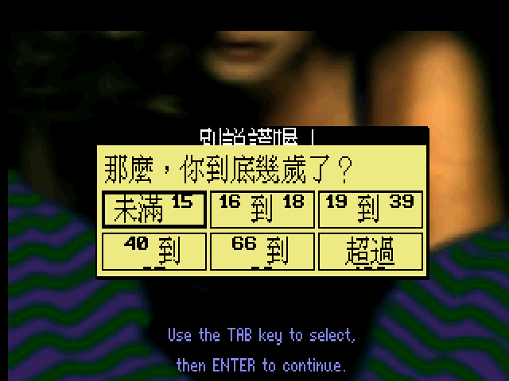 | 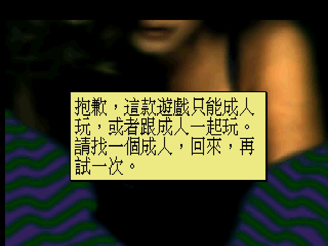 |
| 「那麼，你到底幾歲了？」按 TAB 選、Enter 確認 | 「抱歉，這款遊戲只能成人玩……請找一個成人，回來，再試一次。」 |

這給中文化出了一道難題：**如果把問答全翻成中文，玩家反而對不上英文手冊、答不出來。**

本專案的處理：**問答題採中英雙語顯示**——中文譯文在上、英文原文附在下，選項則保留英文。你既讀得懂題目，又能對照當年的英文手冊/攻略作答。魚與熊掌，這次都給你。

> 真的懶得答？EGA 版按 **Alt-X**、VGA 版按 **Ctrl-Alt-X** 可跳過驗證。

---

## 譯名對照

譯名盡量考據當年台灣慣用法。像考古一樣，不是我們發明的，是還原這款遊戲在華語圈本來的樣子：

| 原文 | 繁中譯名 | 備註 |
|---|---|---|
| Leisure Suit Larry（系列）| **幻想空間** | 華語圈通用系列名 |
| Larry Laffer | **賴瑞** | 台灣主流譯法（非「勞瑞/拉瑞」）|
| Lost Wages | **失樂城** | 諧擬 Las Vegas（原意「輸掉薪水之城」），中文借「失樂園」的雙關——一夜之間，樂園與薪水一起失去 |
| Fawn / Faith / Eve | 芳恩 / 費絲 / 伊芙 | 三位攻略對象 |
| Lefty's Bar | 老左酒吧 | Lefty＝左撇子 |

> ⚠️ 譯名警告：華語圈把 Larry 譯「賴瑞」是主流，但你若在更老的資料看到「勞瑞」「拉瑞」也別意外——那是同一個魯蛇，只是不同年代的譯者各自音譯。系列名《幻想空間》則是三十年來的共識。

---

## 他說沒有中文版。現在有了。

考據到最後，發現一件事：**《幻想空間》初代，官方從來沒有推出過繁體中文版。** 只有近年的新作（《Wet Dreams Don't Dry》、NS《孤島精魂》）才補上官方中文。1987 與 1991 的初代，三十幾年來，中文玩家只能靠英文硬啃。

2018 年，台灣部落格「貝卡的帕德嫩神殿」寫了一篇回顧，標題就叫〈一「炮」而紅的 H-Game——我玩《幻想空間1》〉。作者對那個年代的像素功力嘆為觀止：

> 「圖像設計師是怎麼樣用區區幾個像素，就把他那一臉猥瑣的神情呈現得**活靈活現**？」

他一邊讚嘆、一邊坦言「這系列始終不是我的菜」。那種又愛又嫌、卻始終沒有中文版可玩的遺憾——**這個 repo，就是那份遺憾遲到三十年的回答。**

> 📌 誠實標註：據玩家整理的中文資料頁記載，本作當年在台灣「由智冠代理發行」；但未能找到《軟體世界》《電腦玩家》等當年雜誌評測本作的原始掃描或具體期數，「智冠代理」一說來自玩家資料、年代久遠待考，本文不當作官方硬事實。

---

## 怎麼玩

本中文化為 **ScummVM patch**：需要一份合法的《幻想空間》遊戲資料（EGA 版磁片或 VGA 版），搭配本專案 patch 過的 ScummVM + 中文資產。

1. 準備遊戲資料夾（EGA 版需 `LOGDIR`/`VOL.*` 等；VGA 版需 `RESOURCE.MAP`/`RESOURCE.000-002`）。
2. 把中文資產放進遊戲資料夾：
   - **EGA 版**：`lsl_big5.fnt` + `translation.tsv`
   - **VGA 版**：`lsl1_big5.fnt` + `translation.tsv`
3. 用 patch 過的 ScummVM 啟動：
   - EGA：中文由字型檔存在自動啟用（`--render-mode=ega`）。
   - VGA：加 `--language=tw` 啟用中文。

完整平台包（Windows / macOS / AppImage）詳見 Releases 與 [`docs/00-overall-plan.md`](docs/00-overall-plan.md)。

---

## 技術細節：怎麼讓 1987 年的引擎吐出方塊字

這是本專案最技術的一段，寫給想知道細節的人。核心哲學：**不改遊戲資源，只 patch ScummVM 引擎 + 執行期內容替換。**

- **雙引擎、雙軌**：EGA 版走 ScummVM 的 `agi` 引擎、VGA 版走 `sci` 引擎，兩者字型與文字資源格式完全不同，各自一套 patch（`patches/0001-agi-cht-zh_twn.patch`、`patches/0002-sci-cht-zh_twn.patch`）。
- **內容比對替換（content-keyed）**：外部 `translation.tsv`（英文原文 `\t` Big5 譯文），引擎繪字時用**英文原文當 key** 查表換成中文——不碰壓縮、不動 byte offset，好維護、好 diff。
- **Big5 點陣字**：用系統字型 **AR PL UMing TW 明體** 烘成 16×16 Big5 點陣（`Graphics::Big5Font`），只烘遊戲用到的字（VGA 約 2,245 字）。
- **拉高畫布**：EGA 軌強制 ScummVM 內建的 **640×400 hi-res** 顯示，讓 16×16 中文字有空間（rulebook：拉高畫布不縮字）。
- **踩過的雷**（給後人）：
  - AGI 走 fallback 偵測，target 語言設成**任何非英文都會讓遊戲無法啟動** → EGA 改用「字型檔存在」當開關，不靠 `--language`。
  - SCI 的 `GfxFontChinese._big5Height` 必須對齊烘字高度（14→16），否則位元組錯位缺字。
  - SCI 對 Big5 斷行沒有空格會塞到訊息框邊框裁字 → 換行留 6px 邊距。

工具鏈：`extract_agi.py`（AGI LOGIC 訊息抽字）、`extract_strings.py`（SCI 文字資源）、`build_cht.py`（TTF→Big5 點陣）、`merge_translations.py`、`apply_patches.sh`。

---

## 交付政策 · 授權 · 致謝

- **交付政策**：GitHub repo 只放 **patch-only** 版本（引擎 patch + 字型 + 翻譯表 + 工具鏈）。完整遊戲包（含原始資源）**不上傳**。打包平台：Windows / macOS / AppImage。
- **授權**：中文化 patch 依 ScummVM 之 GPL 授權。原始遊戲版權屬 Sierra / Activision，本專案不含任何原始遊戲資源。
- **致謝**：
  - **Al Lowe** — 那個穿廉價西裝的魯蛇的父親。
  - **Sierra On-Line** 與 ScummVM 團隊。
  - 台灣早年引進 Sierra 冒險遊戲的**《軟體世界》、第三波、《電腦玩家》**世代——是你們讓這些遊戲有機會出現在我們的 14 吋螢幕上。
  - 部落格「貝卡的帕德嫩神殿」那篇 2018 回顧文 —— 你說這系列不是你的菜，但你那句「活靈活現」，正是我們做這份中文化的理由。
